# 화면분석

[TOC]

# 로그인

## 42seoul 로그인

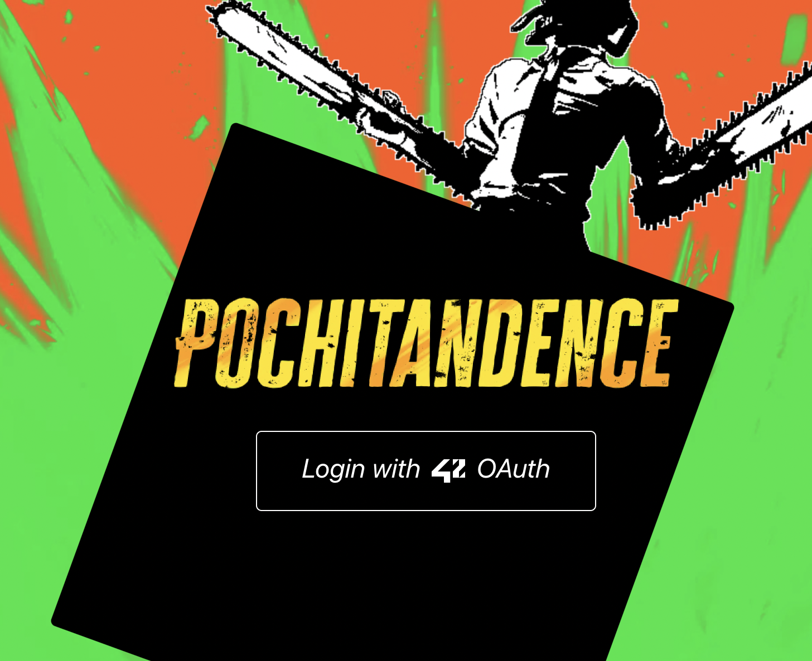

| No   | attribute      | comment                 | type   | required      | event               |
| ---- | -------------- | ----------------------- | ------ | ------------- | ------------------- |
| 1    | 42 oauth login | 42auto 로그인 버튼이다. | button | 42서울 로그인 | 로그인페이지로 이동 |
| 2    |                |                         |        |               |                     |

## 로그인

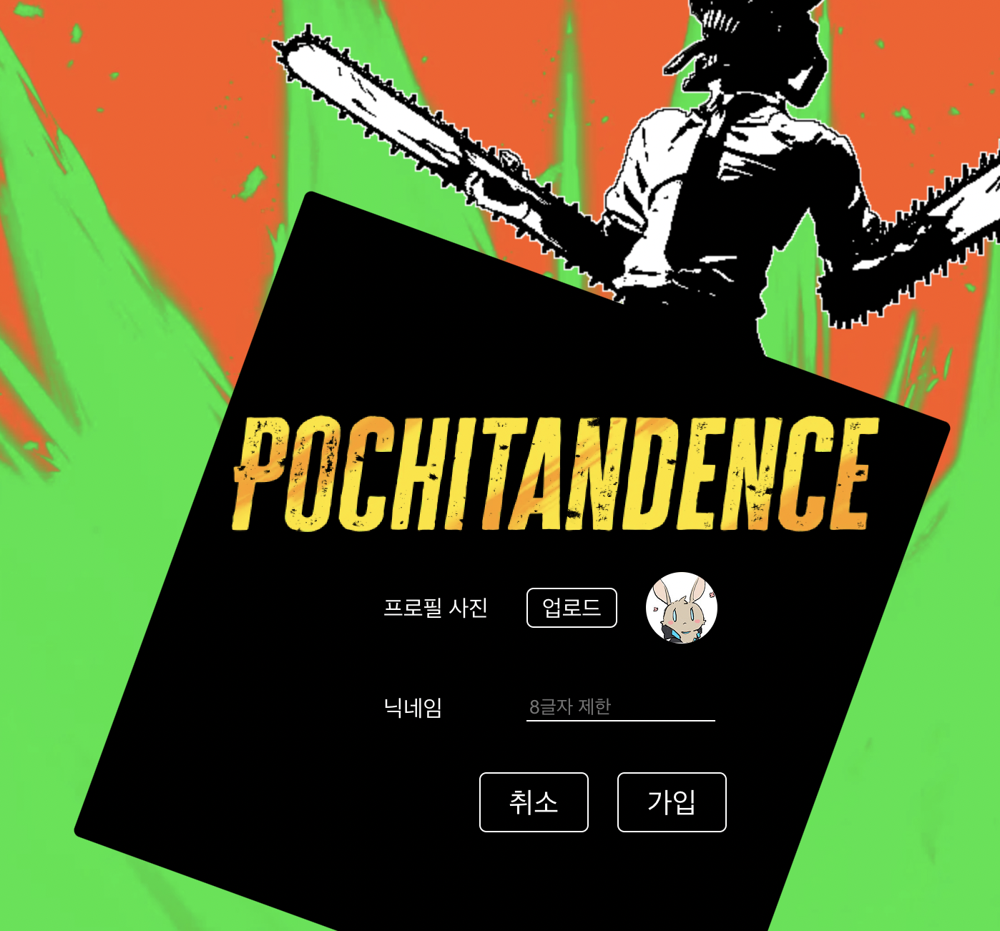

| No   | attribute     | comment                                             | type   | required | event          |
| ---- | ------------- | --------------------------------------------------- | ------ | -------- | -------------- |
| 1    | 업로드        | 프로필 이미지 업로드를 할 수 있다.                  | button | -        | 이미지선택(os) |
| 2    | 업로드 이미지 | 업로드 기능으로 선택한 이미지 표출                  | image  | 1번 선행 | -              |
| 3    | 닉네임        | 사용할 닉네임을 입력한다.                           | input  | -        | -              |
| 4    | 가입          | 신규 닉네임으로 가입한다.                           | button | 3번 선행 | 가입           |
| 5    | 취소          | -                                                   | button |          |                |
| 6.   | 닉네임 체크   | 존재하는 닉네임인지 체크 후 체크 이미지를 표출한다. | label  | 3번 선행 | 닉네임 검증    |

- 닉네임 미사용 고려.

# 대기실

## 메인화면 / 대기실

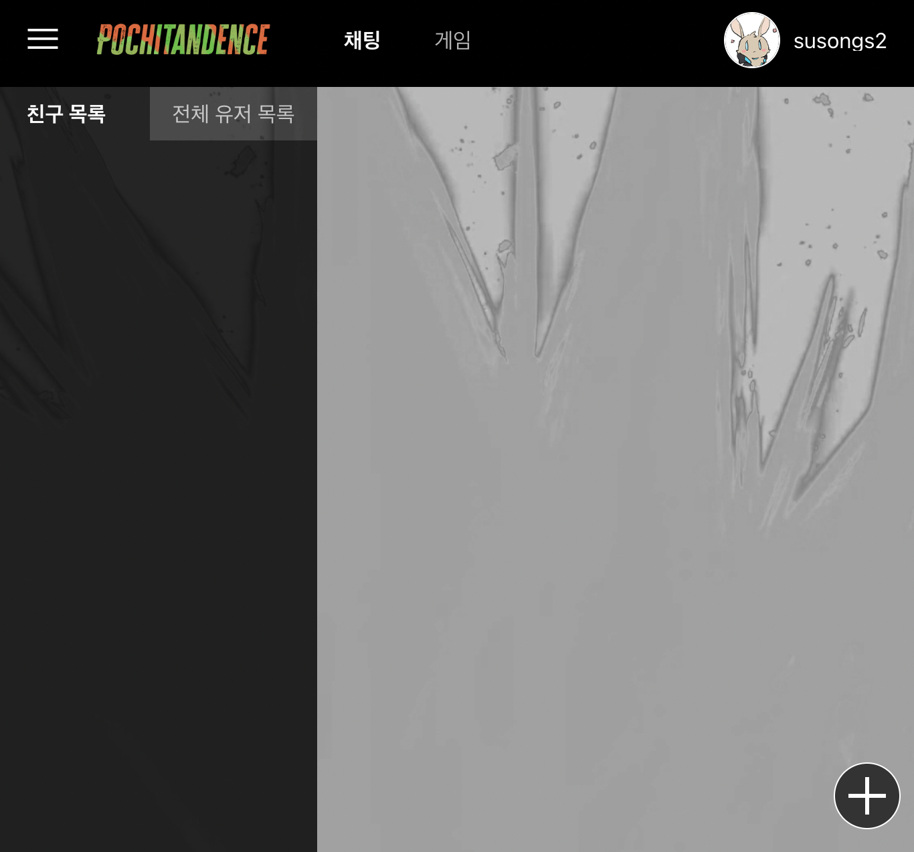

| No   | attribute       | comment                      | type   | required | event                     |
| ---- | --------------- | ---------------------------- | ------ | -------- | ------------------------- |
| 1    | 네비게이션 버튼 | 친구,전체유저 목록 show/hide | button | -        | toggle                    |
| 2    | HOME 버튼       | 대기실 처음화면으로 이동     | button | -        | 처음화면으로 이동         |
| 3    | 채팅 버튼       | 채팅 메인화면으로 이동       | button | -        | 채팅 메인화면으로 이동    |
| 4    | 게임 버튼       | 게임 메인화면으로 이동       | button | -        | 게임 메인화면으로 이동    |
| 5    | 프로필 버튼     | 나의 프로필 화면으로 이동    | button | -        | 프로필 화면으로 이동      |
| 6    | PLUS 버튼       | 게임/채팅 메뉴 호출.         | button | -        | 게임/채팅 메뉴 호출       |
| 7    | 친구목록        | 나의 친구목록을 표출한다.    | button | -        | 나의 친구목록을 표출한다. |
| 8    | 전체유저목록    | 전체 유저목록을 표출한다.    | button | -        | 전체 유저목록을 표출한다. |

## 전체유저목록

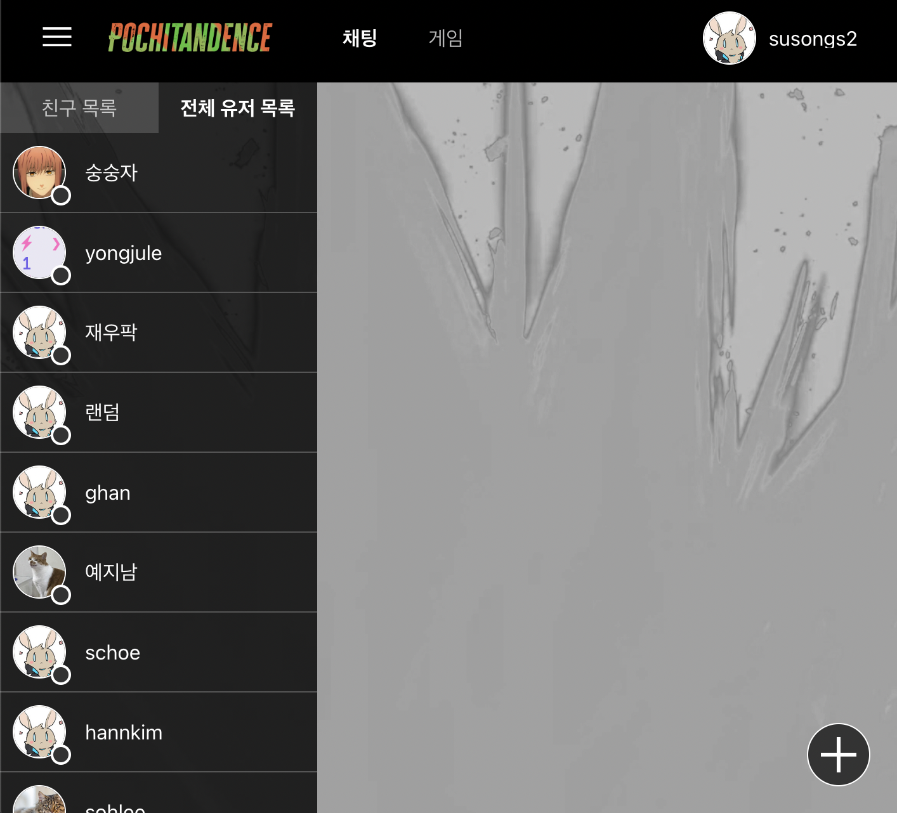

| No   | attribute         | comment                                                      | type   | required | event    |
| ---- | ----------------- | ------------------------------------------------------------ | ------ | -------- | -------- |
| 1    | 전체유저목록 버튼 | 전체유저를 표출한다. - 프로필이미지, 닉네임, 로그인여부 | list   | -        | 목록조회 |
| 2    | 프로필 버튼       | 프로필을 클릭하면, 해당 유저 프로필 상세화면으로 이동한다.   | button | -        | 클릭     |

## 채팅 목록화면

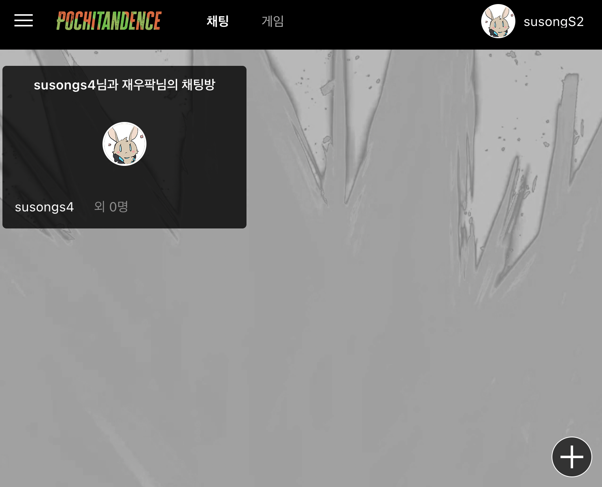

| No   | attribute     | comment                                                      | type   | required                  | event    |
| ---- | ------------- | ------------------------------------------------------------ | ------ | ------------------------- | -------- |
| 1    | 채팅 목록     | 생성된 채팅리스트 목록을 표출한다. - 채팅방이름, 참가자 프로필들, 접속인원, owner이름 | list   | -                         | 목록조회 |
| 2    | 채팅카드 클릭 | 클릭한 채팅방으로 이동한다. - public : 이동 - protected : 비밀번호 입력 후 이동 - private 이동 불가 | button | protected : 패스워드 입력 | 클릭     |

# 프로필

## 내 프로필

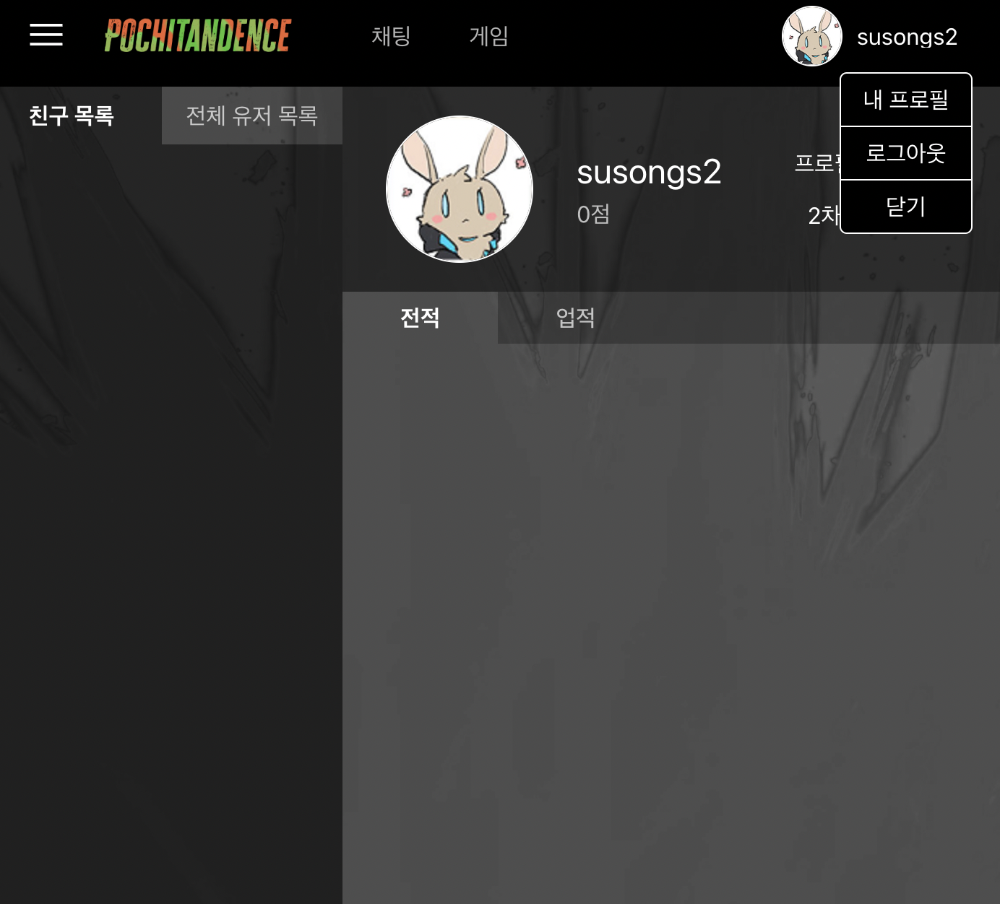

| No   | attribute      | comment                              | type   | required | event    |
| ---- | -------------- | ------------------------------------ | ------ | -------- | -------- |
| 1    | 내 프로필 버튼 | 내 프로필 화면으로 이동한다.         | button | -        | 화면호출 |
| 2    | 로그아웃 버튼  | 로그아웃 후 로그인화면으로 이동한다. | button | -        | 로그아웃 |
| 3    | 닫기 버튼      | 닫는다                               | button | -        | -        |
| 4    | 전적버튼       | 전적 리스트를 표출한다.              | button | -        | 목록조회 |

- 닫기버튼 삭제 (hover)

## 내 프로필2

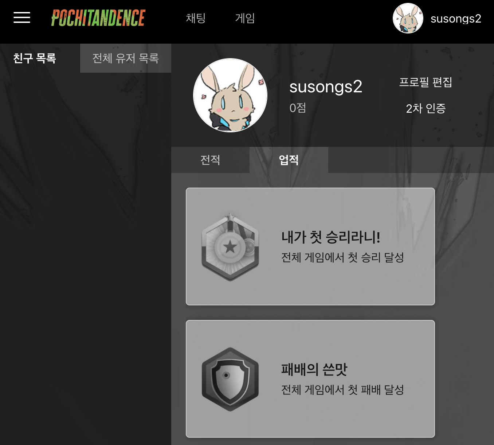

| No   | attribute       | comment                                                      | type   | required | event    |
| ---- | --------------- | ------------------------------------------------------------ | ------ | -------- | -------- |
| 1    | 업적 버튼       | 나의 업적을 카드목록을 표출한다. - 업적이미지, 업척타이들, 업적내용 - 업적 달성유무에 따라 이미지를 다르게 표출한다. | button | -        | 목록조회 |
| 2    | 프로필편집 버튼 | 프로필 편집 레이어팝업을 호출한다.                           | button | -        | 팝업호출 |
| 3    | 2차인증         | 수송이 알아서                                                | button | -        | -        |

## 프로필 수정

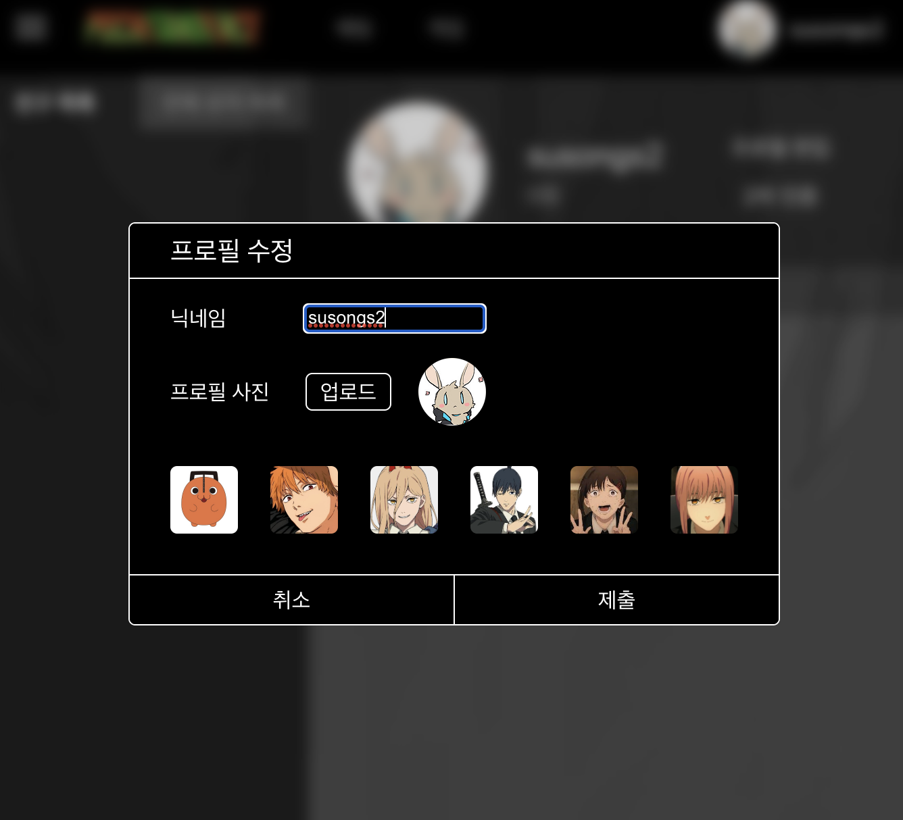

| No   | attribute           | comment                                                      | type   | required     | event          |
| ---- | ------------------- | ------------------------------------------------------------ | ------ | ------------ | -------------- |
| 1    | 업로드닉네임 입력창 | 프로필 이미지 업로드를 할 수 있다.                           | button | -            | 이미지선택(os) |
| 2    | 닉네임 입력창       | 수정할 닉네임 입력                                           | input  | -            | -              |
| 3    | 기본이미지 목록     | app이제공하는 기본 프로필이미지를 표출한다.                  | list   | -            | -              |
| 4    | 제출버튼            | 변경한 정보로 프로필을 변경한다. - 제출을 성공하면 변경된 정보를 화면에 적용한다. | button | 2번,6번 선행 | post           |
| 5    | 취소버튼            | 프로필 변경을 취소한다,                                      | button | -            | -              |
| 6.   | 닉네임 체크         | 존재하는 닉네임인지 체크 후 체크 이미지를 표출한다.          | label  | 2번 선행     | 닉네임 검증    |

## 프로필 상세(유저) 

- 전체유저목록 > 프로필 클릭
-  채팅 프로필 클릭

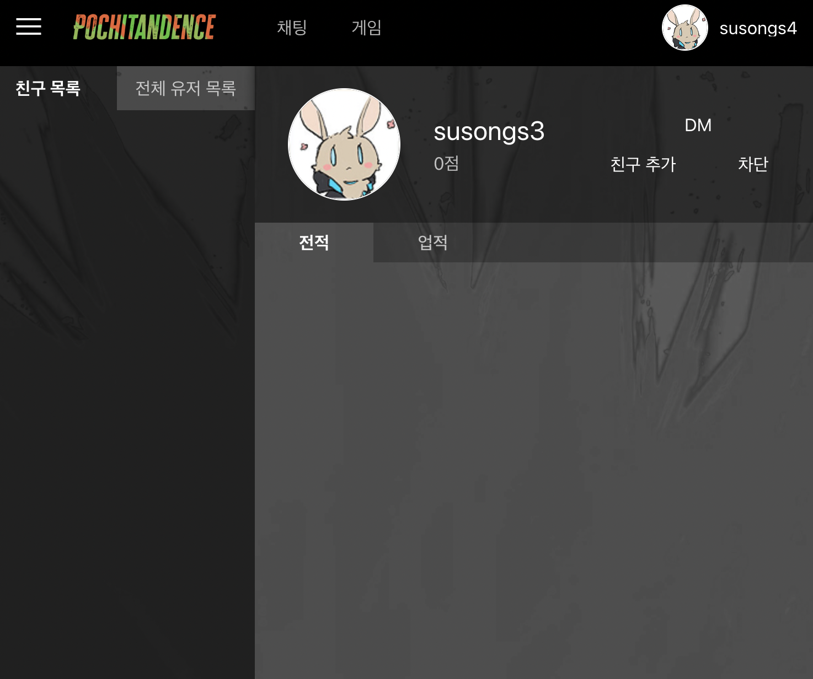

| No   | attribute      | comment                                                      | type   | required | event                              |
| ---- | -------------- | ------------------------------------------------------------ | ------ | -------- | ---------------------------------- |
| 1    | 유저 정보 박스 | 특정 유저의 정보를 표출한다. - 닉네임, 래더 점수, image | box    | -        | 정보조회                           |
| 2    | 전적버튼       | 특정 유져의 전적 리스트를 표출한다.                          | button | -        | 목록조회                           |
| 3    | 업적 버튼      | 특정 유저의 업적을 카드목록을 표출한다. - 업적이미지, 업척타이들, 업적내용 - 업적 달성유무에 따라 이미지를 다르게 표출한다. | button | -        | 목록조회                           |
| 4    | DM 버튼        | 특정 유저와의 채팅방을 private 모드로 개설한다. - 온라인으로 접속한 유저에게만 DM 가능 - DM 채팅방 페이지로 이동 | button | -        | 페이지 이동                        |
| 5    | 친구 추가 버튼 | 친구 목록에 추가 - 친구 목록에 없어야 활성화            | button | -        | 친구 목록에 추가 8번 활성화   |
| 6    | 차단 버튼      | 차단 목록에 추가 - 친구 목록에 없어야 활성화            | button | -        | 차단 목록에 추가 7번 활성화   |
| 7    | 차단 삭제 버튼 | - 차단 목록에서 제거 - 차단 목록에 있어야 활성화        | button | 6번 선행 | 차단 목록에서 제거 6번 활성화 |
| 8    | 친구 삭제 버튼 | 친구 목록에서 제거 - 친구 목록에 있어야 활성화          | button | 5번 선행 | 친구 목록에서 제거 5번 활성화 |

## 프로필 상세2(유저) 

- [전체유저목록] 참조(내용 중복 생략)

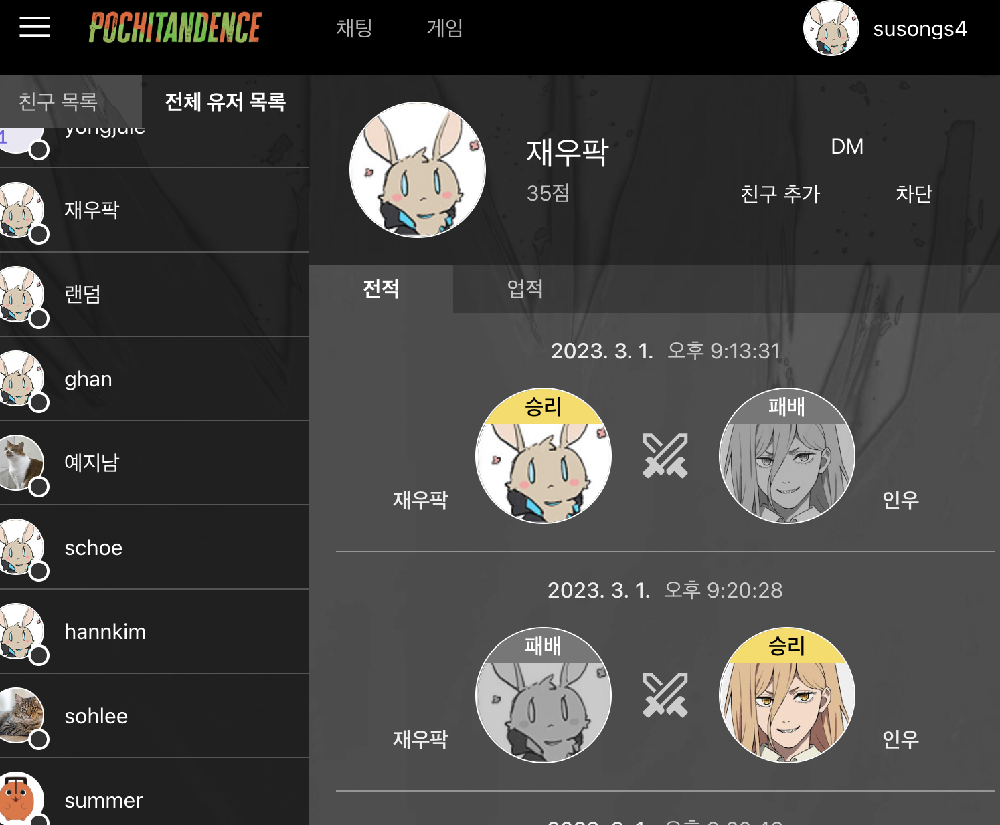

| No   | attribute | comment | type | required | event |
| ---- | --------- | ------- | ---- | -------- | ----- |
| 1    |           |         |      |          |       |

# 채팅

## 채팅 목록 조회

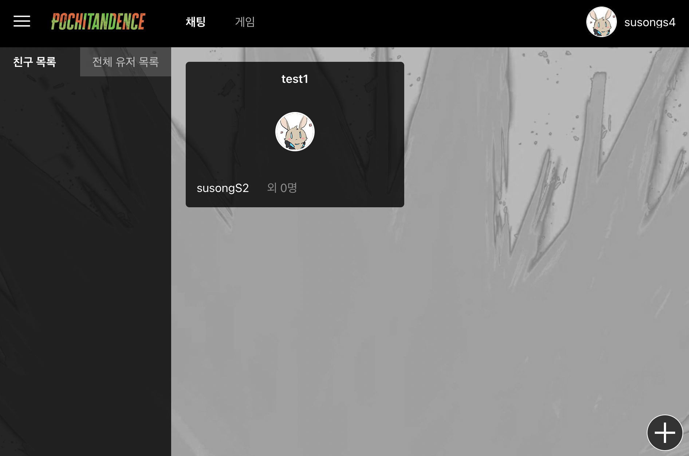

| No   | attribute      | comment                                                      | type   | required | event           |
| ---- | -------------- | ------------------------------------------------------------ | ------ | -------- | --------------- |
| 1    | 채팅 목록 박스 | 현재 개설된 모든 채팅방을 표출합니다.                        | box    | -        | 목록조회        |
| 2    | 채팅 카드      | 채팅 카드를 클릭하여 채팅방에 입장할 수 있습니다. - public : 특정 채팅방 페이지로 이동 - protected : 비밀번호 입력 레이어팝업 호출 - private : DM 해당자가 아니면 이동 불가 - 차단 목록에 있는 유저는 참여할 수 없습니다. | card   | -        | 페이지 이동     |
| 3    | PLUS 버튼      | 새로운 채팅방을 생성할 수 있습니다. - 채팅방 생성 레이어팝업 호출 | button | -        | 레이어팝업 호출 |
|      |                |                                                              |        |          |                 |

## 채팅방 생성

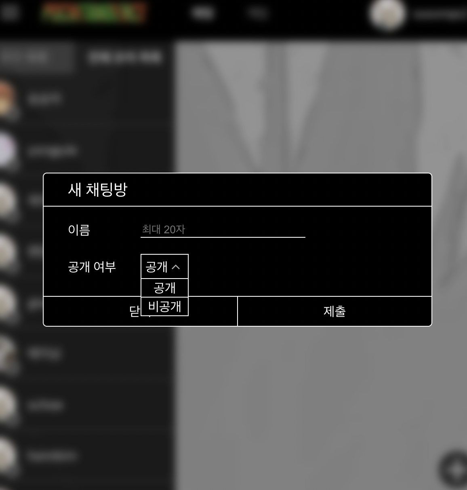

| No   | attribute                  | comment                                                      | type      | required           | event       |
| ---- | -------------------------- | ------------------------------------------------------------ | --------- | ------------------ | ----------- |
| 1    | 채팅방 이름 입력           | 채팅방 이름을 입력합니다. - 최대 20자로 제한            | input     | -                  | -           |
| 2    | 채팅방 공개 여부 콤보 박스 | 채팅방 공개 여부를 선택합니다. - 공개 : public 채팅방 - 비공개 : protected 채팅방(비밀번호 필요) | combo-box | -                  | -           |
| 3    | 비밀번호 입력              | 채팅방에 설정할 비밀번호를 입력합니다. - 2번이 비공개로 선택되어야 활성화 | input     | 2번 선행           | -           |
| 4    | 닫기 버튼                  | 레이어팝업을 닫습니다.                                       | button    | -                  | -           |
| 5    | 제출 버튼                  | 채팅방을 생성합니다.                                         | button    | 1번, 2번, 3번 선행 | 페이지 이동 |

## 채팅 상세

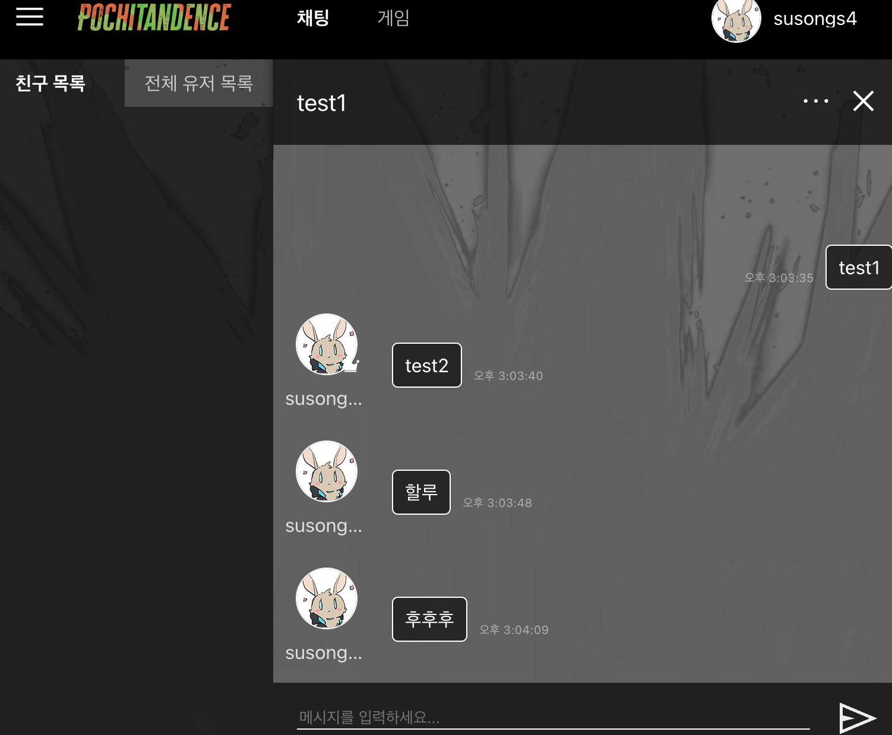

| No   | attribute                  | comment                                                      | type   | required | event           |
| ---- | -------------------------- | ------------------------------------------------------------ | ------ | -------- | --------------- |
| 1    | 메시지 입력                | 메시지를 입력합니다.                                         | input  | -        | -               |
| 2    | 메시지 전송 버튼           | 입력한 메시지를 채팅방에 전송합니다.                         | button | -        | 소켓 write      |
| 3    | 채팅방 정보 수정 버튼(...) | [admin, owner] 채팅창 정보 수정 레이어팝업을 호출합니다.     | button | -        | 레이어팝업 호출 |
| 4    | 채팅방 종료 버튼           | 채팅방에서 나갑니다. - 새로운 owner : 1) 관리자 중 한 명 2) 없으면 가장 처음 유저로 설정합니다. | button | -        | -               |
| 5    | 유저 image                 | 해당 유저 프로필 페이지로 이동합니다.                        | button | -        | 페이지 이동     |

## 채팅방 정보 수정

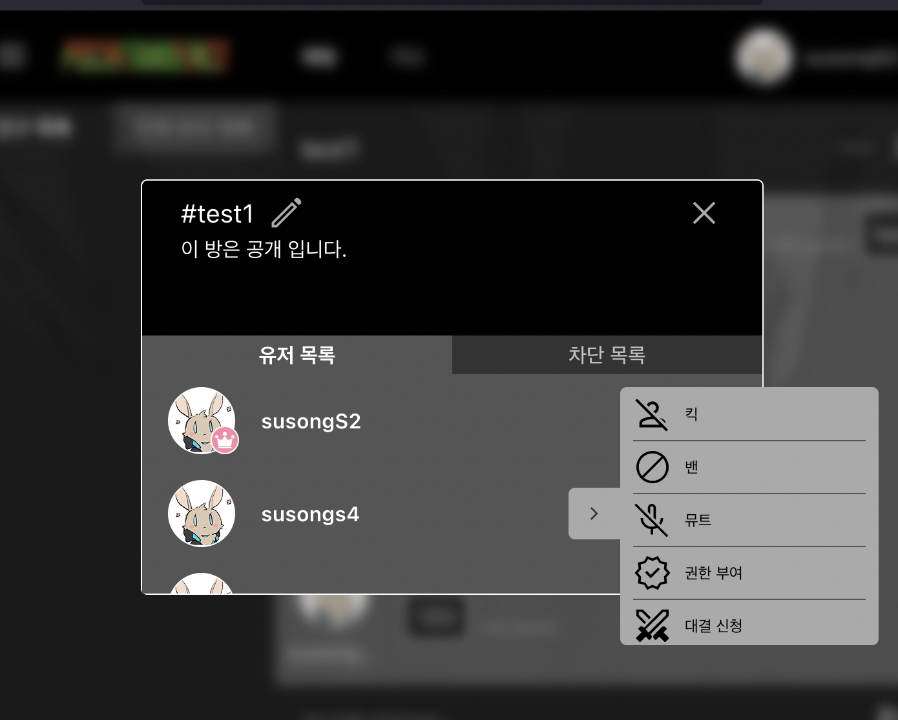

| No   | attribute                       | comment                                                      | type      | required      | event                     |
| ---- | ------------------------------- | ------------------------------------------------------------ | --------- | ------------- | ------------------------- |
| 1    | 채팅방 이름 수정 버튼           | [admin, owner] 채팅방 이름 수정이 가능하도록 하는 버튼입니다. - 2번, 3번 활성화 | button    | -             | 2번, 3번 활성화           |
| 2    | 채팅방 이름 입력                | [admin, owner] 채팅방 이름을 입력합니다.                     | input     | 1번 선행      | -                         |
| 3    | 채팅방 이름 저장 버튼           | [admin, owner]  채팅방 이름을 수정합니다. - 2번, 3번, 4번, 5번 비활성화 | button    | 1번 선행      | 수정                      |
| 4    | 채팅방 공개 설정 수정 콤보 박스 | [admin, owner] 채팅방 공개 설정 범위를 설정합니다. - 5번 활성화 | combo-box | 1번 선행      | 수정  4번 활성화     |
| 5    | 채팅방 비밀번호 수정 입력       | [admin, owner] protected 모드로 설정할 때 필요한 비밀번호를 설정합니다. | input     | 1번, 4번 선행 | -                         |
| 6    | 유저 목록 버튼                  | 채팅방에 참여한 유저 목록을 보여줍니다.                      | button    | -             | 목록조회                  |
| 7    | 차단 목록 버튼                  | 나의 차단 목록을 보여줍니다.                                 | button    | -             | 목록조회                  |
| 8    | 킥 버튼                         | [admin, owner] 특정 유저를 추방합니다. - admin, owner는 서로 6 ~ 9번 하지 못하도록? - 킥 당한 사람은 다시 들어오지 못함(버그인듯) | button    | -             | 채팅방 유저 목록에서 제거 |
| 9    | 밴 버튼                         | [admin, owner] 특정 유저를 추방하고 차단 목록에 추가합니다.  | button    | -             | 차단 목록에 추가          |
| 10   | 뮤트 버튼                       | [admin, owner] 특정 유저가 전송한 메시지를 채팅방에 표시하지 않습니다. | button    | -             |                           |
| 11   | 권한 부여 버튼                  | [admin, owner] 1 ~ 3번, 6 ~9번 속성을 사용할 수 있는 권한을 추가로 부여합니다. | button    | -             | 권한 리스트에 유저 추가   |
| 12   | 대결신청 버튼                   | 특정 유저에게 pong 대결을 신청합니다. - 차단한 유저에게는 불가? | button    | -             | 상대방 레이어팝업 호출    |
| 13   | 닫기 버튼                       | 채팅방 정보 수정 레이어팝업을 닫습니다.                      | button    | -             | -                         |
| 14   | 유저 image                      | 해당 유저 프로필 페이지로 이동합니다.                        | button    | -             | 페이지 이동               |

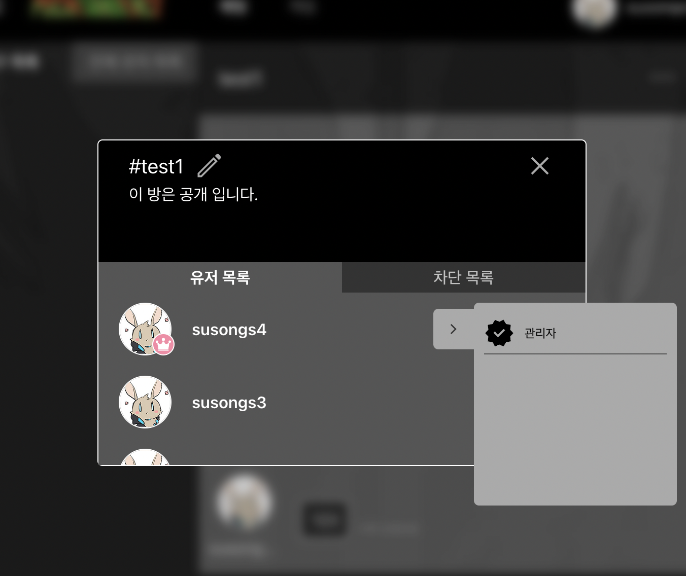

| No   | attribute     | comment                                       | type   | required | event |
| ---- | ------------- | --------------------------------------------- | ------ | -------- | ----- |
| 1    | 관리자 버튼   | 자신을 선택했을 때, 관리자이면 표시됩니다.    | button | -        | -     |
| 2    | 일반유저 버튼 | 자신을 선택했을 때, 일반 유저이면 표시됩니다. | button | -        | -     |
|      |               |                                               |        |          |       |
|      |               |                                               |        |          |       |

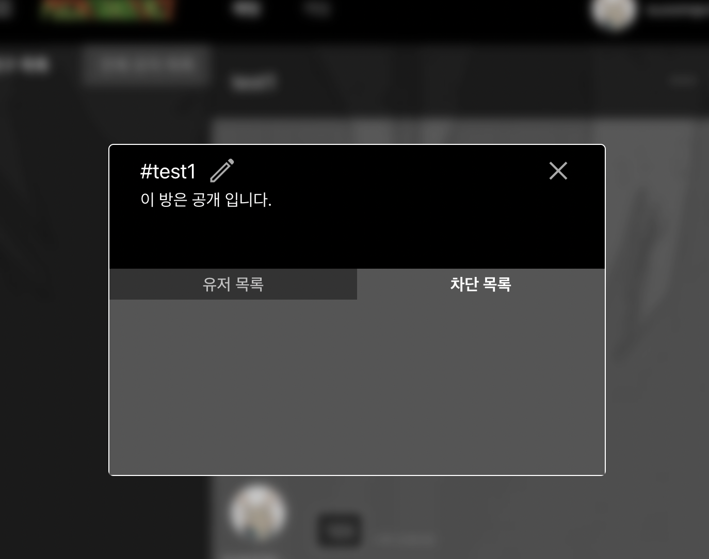

| No   | attribute    | comment                                  | type   | required | event |
| ---- | ------------ | ---------------------------------------- | ------ | -------- | ----- |
| 1    | 밴 해제 버튼 | [admin, owner] 차단 목록에서 해제합니다. | Button | -        | -     |
| 2    |              |                                          |        |          |       |
|      |              |                                          |        |          |       |
|      |              |                                          |        |          |       |

## 채팅목록 (DM -private)

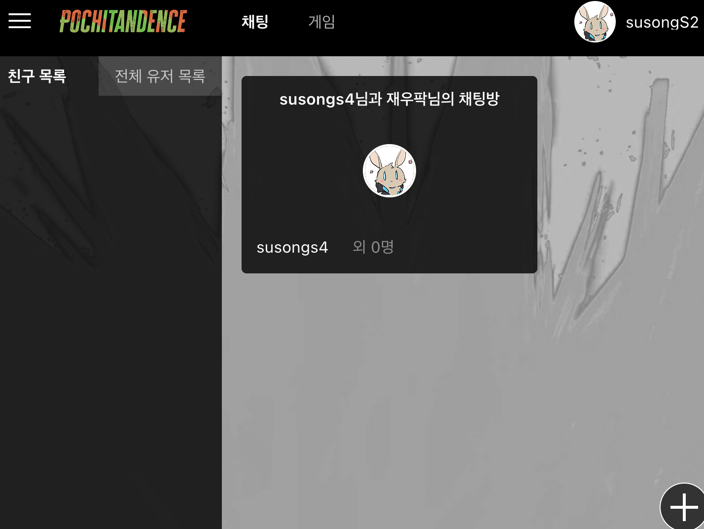

| No   | attribute | comment                                                      | type | required | event       |
| ---- | --------- | ------------------------------------------------------------ | ---- | -------- | ----------- |
| 1    | 채팅 카드 | DM 해당자가 아니면 이동 불가 - 차단 목록에 있는 유저는 참여할 수 없습니다. | card | -        | 페이지 이동 |
|      |           |                                                              |      |          |             |
|      |           |                                                              |      |          |             |
|      |           |                                                              |      |          |             |

## 채팅목록 (패스워드방 - protected)

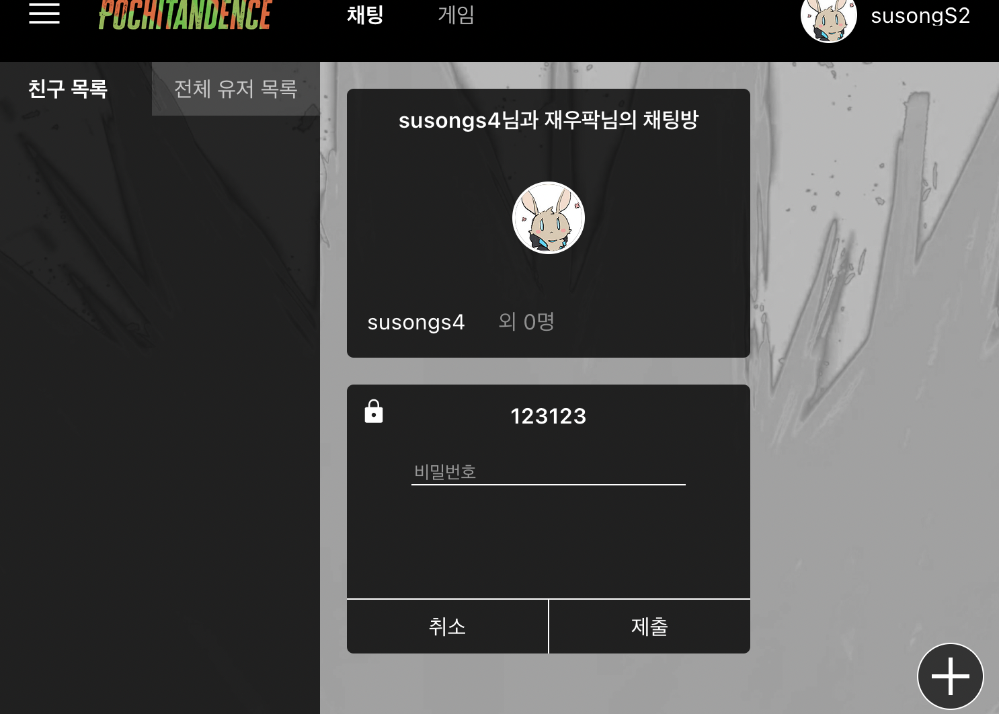

| No   | attribute     | comment                                   | type   | required | event       |
| ---- | ------------- | ----------------------------------------- | ------ | -------- | ----------- |
| 1    | 비밀번호 입력 | protected 채팅방의 비멀번호를 입력합니다. | input  | -        | -           |
| 2    | 취소 버튼     | protected 채팅방 입장을 취소합니다.       | button | -        | -           |
| 3    | 제출 버튼     | protected 채팅방에 입장합니다.            | button | 1번      | 페이지 이동 |
|      |               |                                           |        |          |             |

# 게임

## 게임 메인화면

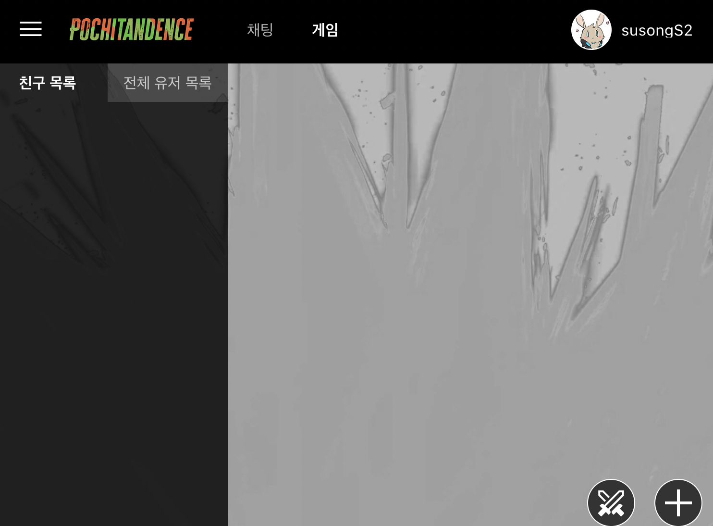

| No   | attribute | comment                            | type   | required | event |
| ---- | --------- | ---------------------------------- | ------ | -------- | ----- |
| 1    | 래더 버튼 | 래더 매칭 레이어팝업을 호출합니다. | button | -        | -     |
| 2    | PLUS 버튼 | 게임 생성 레이어팝업을 호출합니다. | button | -        | -     |
|      |           |                                    |        |          |       |
|      |           |                                    |        |          |       |

## 새 게임 만들기

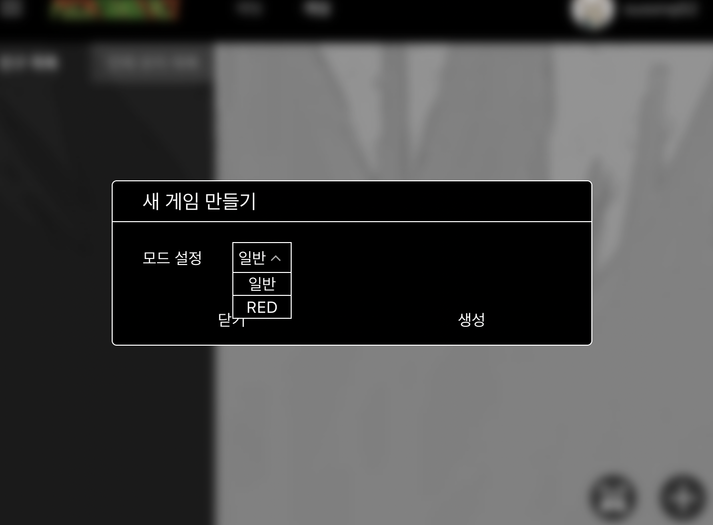

| No   | attribute           | comment                             | type      | required | event           |
| ---- | ------------------- | ----------------------------------- | --------- | -------- | --------------- |
| 1    | 모드 설정 콤보 박스 | 일반 모드와 RED 모드 중 선택합니다. | combo-box | -        | -               |
| 2    | 닫기 버튼           | 레이어팝업을 닫습니다.              | button    | -        | 레이어팝업 닫기 |
| 3    | 생성 버튼           | 새로운 게임을 생성합니다.           | button    | -        | 페이지 이동     |
|      |                     |                                     |           |          |                 |

## 게임 목록 조회

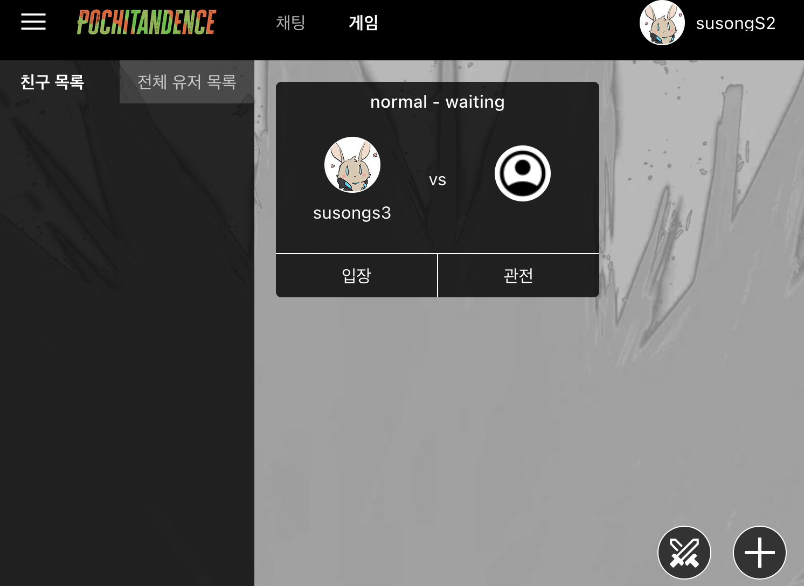

| No   | attribute | comment                                                      | type   | required | event       |
| ---- | --------- | ------------------------------------------------------------ | ------ | -------- | ----------- |
| 1    | 입장 버튼 | 해당 게임에 입장할 수 있습니다. - 차단한 유저와도 같이 게임할 수 있음 | button | -        | 페이지 이동 |
| 2    | 관전 버튼 | 해당 게임을 관전할 수 있습니다.                              | button | -        | 페이지 이동 |
|      |           |                                                              |        |          |             |
|      |           |                                                              |        |          |             |

## 게임 화면

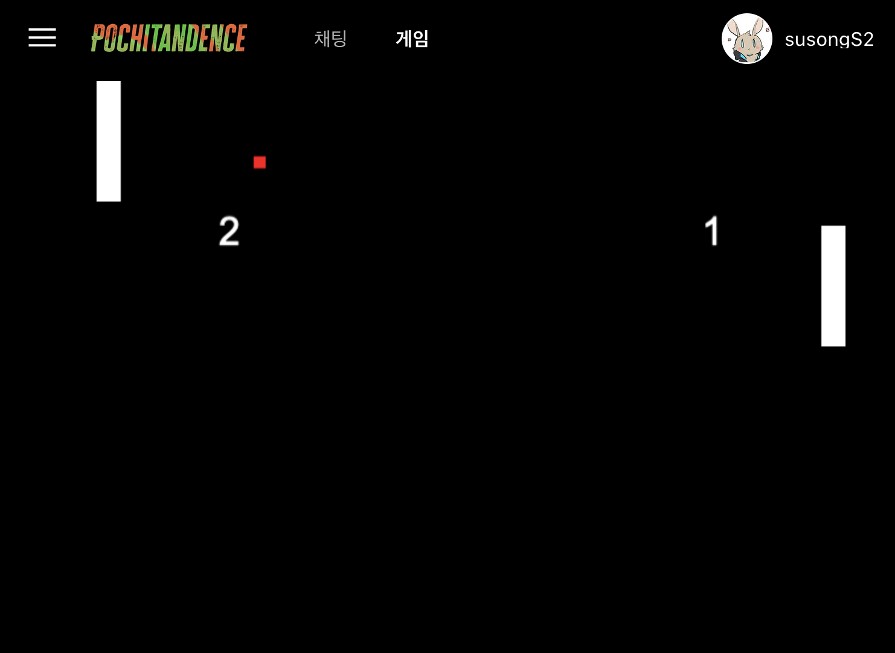

| No   | attribute | comment                                                      | type | required | event              |
| ---- | --------- | ------------------------------------------------------------ | ---- | -------- | ------------------ |
| 1    | 공        | 공의 위치가 양 끝이 되면 점수가 올라감 - 경기 정보를 업데이트 | -    | -        | 공 위치 업데이트   |
| 2    | 막대      | 막대 위치를 주기적으로 계속 업데이트                         | -    | -        | 막대 위치 업데이트 |
| 3    | 점수판    | 경기 정보를 표시 - 점수가 났을 때, 점수판을 업데이트    | -    | -        | 점수판 업데이트    |
|      |           |                                                              |      |          |                    |

## 게임 결과 화면

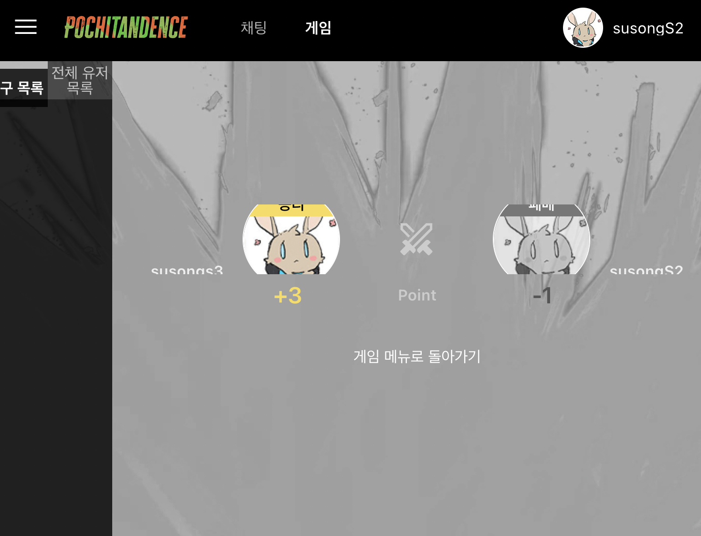

| No   | attribute       | comment                        | type   | required | event       |
| ---- | --------------- | ------------------------------ | ------ | -------- | ----------- |
| 1    | 점수판          | 최종 점수를 표출한다.          | box    | -        | -           |
| 2    | 되돌아가기 버튼 | 게임 메인 화면으로 되돌아간다. | button | -        | 페이지 이동 |
|      |                 |                                |        |          |             |
|      |                 |                                |        |          |             |

## 게임 레더 찾기

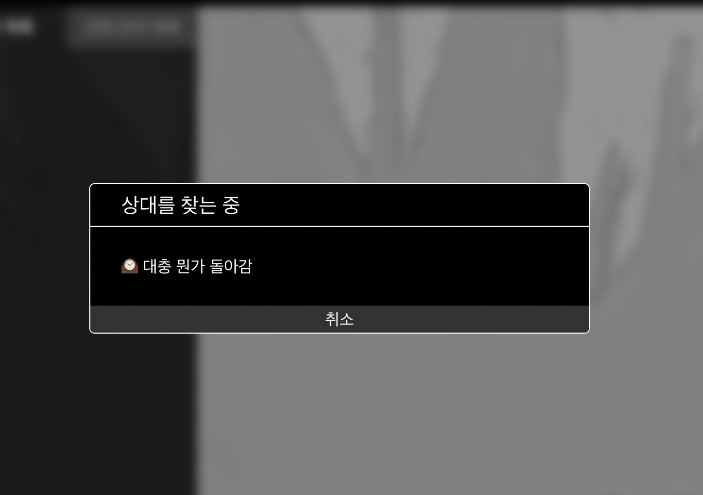

| No   | attribute           | comment                 | type   | required | event |
| ---- | ------------------- | ----------------------- | ------ | -------- | ----- |
| 1    | 래더 매칭 취소 버튼 | 랜덤 매칭을 취소합니다. | button | -        | -     |
|      |                     |                         |        |          |       |
|      |                     |                         |        |          |       |
|      |                     |                         |        |          |       |

## 게임생성  후

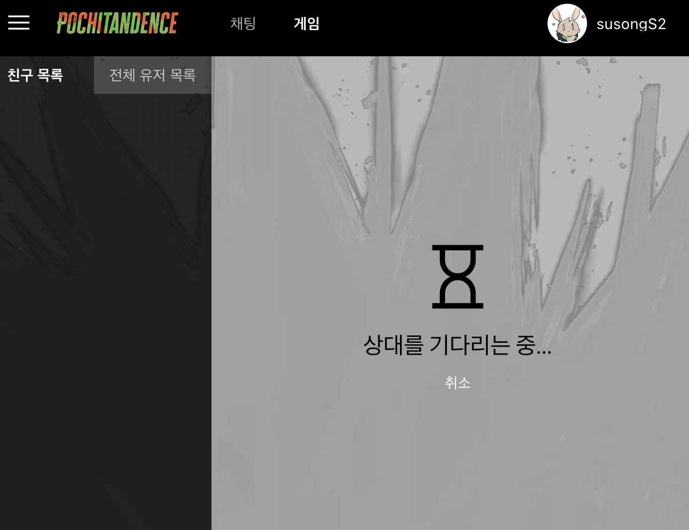

| No   | attribute | comment                   | type   | required | event       |
| ---- | --------- | ------------------------- | ------ | -------- | ----------- |
| 1    | 취소 버튼 | 생성된 게임방에서 나간다. | button | -        | 페이지 이동 |
| 2    |           |                           |        |          |             |
|      |           |                           |        |          |             |
|      |           |                           |        |          |             |

